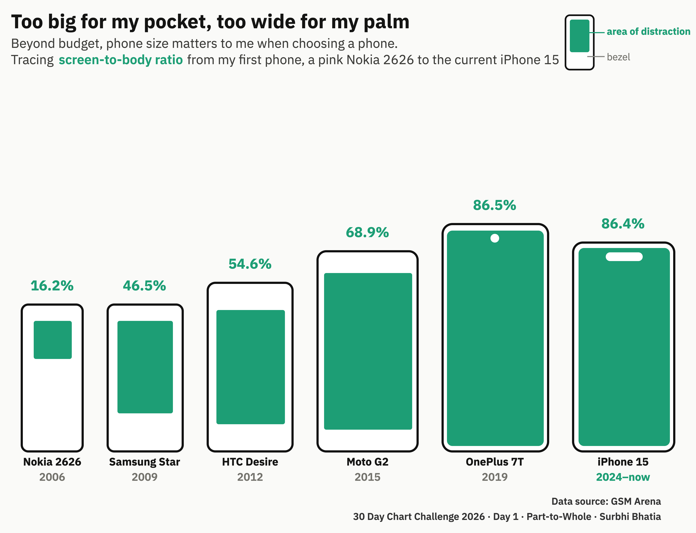
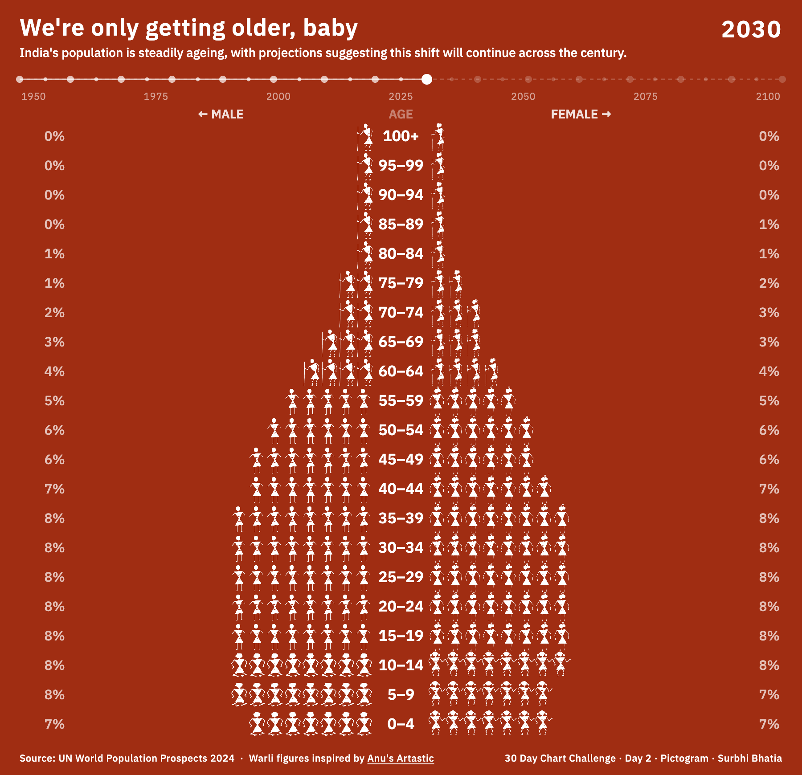
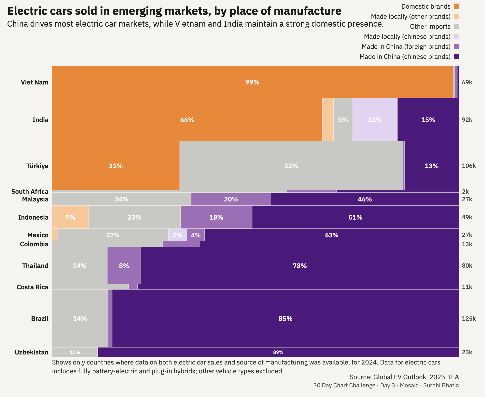
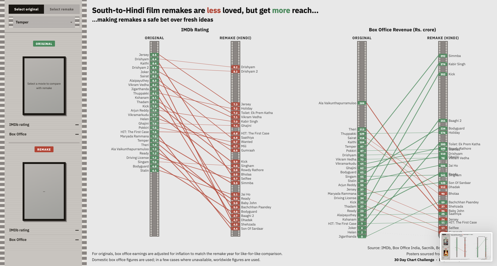
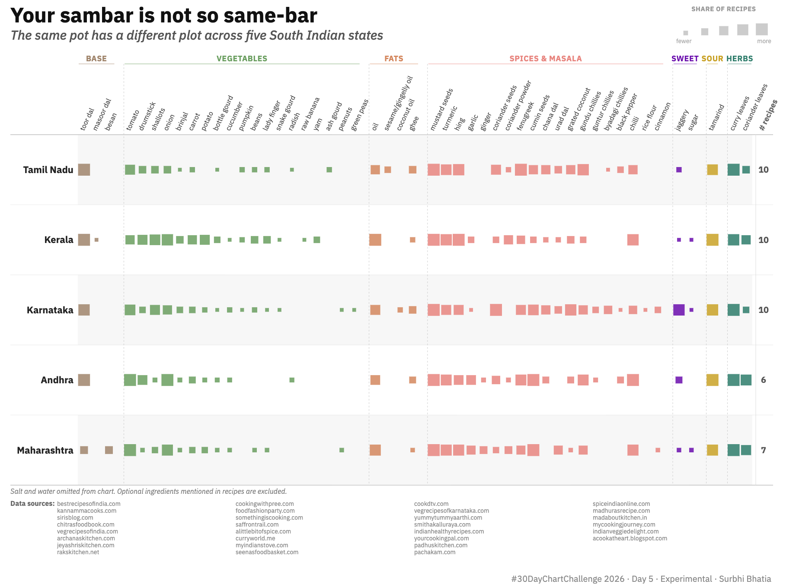
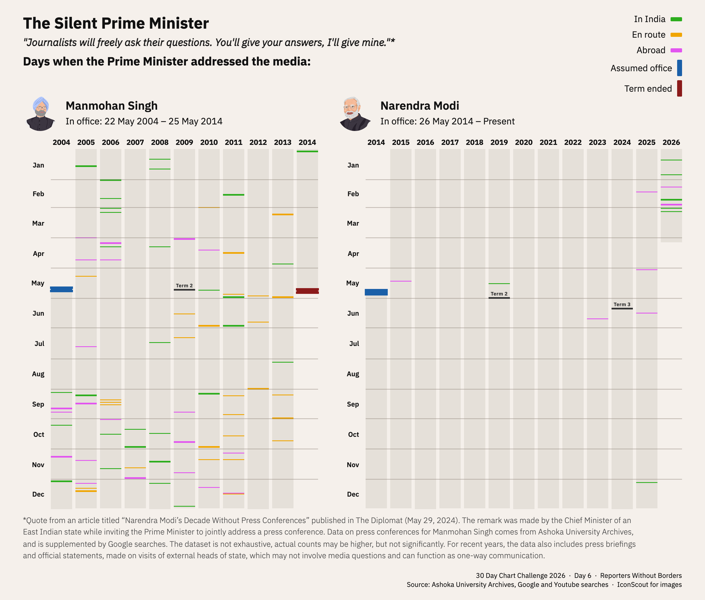
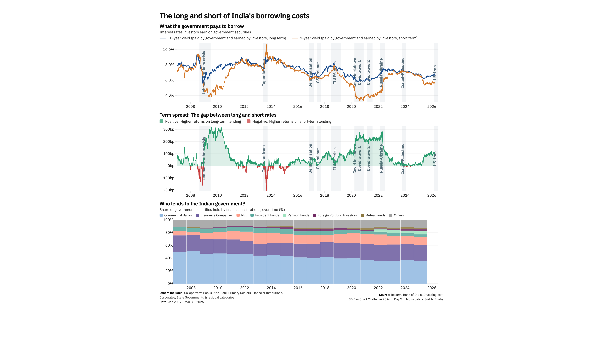

# thirty charts in thirty days

My contributions to the [#30DayChartChallenge 2026](https://github.com/30DayChartChallenge/Edition2026).

Link to notebook with data for all days: [link]

<table>
  <tr>
    <td align="center"><b>Day 1: Part-to-Whole</b>  </td>
     <td align="center"><b>Day 2: Pictogram</b>  </td>
     <td align="center"><b>Day 3: Mosaic</b>  </td>
  </tr>
  <tr>
     <td align="center"><b>Day 4: Slope</b>  </td>
     <td align="center"><b>Day 5: Experimental</b>  </td>
     <td align="center"><b>Day 6: Reporters Without Borders Data day</b>  </td>
  </tr>
  <tr>
    <td align="center"><b>Day 7: Multiscale</b>  </td>
    <td align="center"><b>Day 8: Circular</b>   </td>
    <td align="center"><b>Day 9: Wealth</b>   </td>
  </tr>
  <tr>
    <td align="center"><b>Day 10: Pop Culture</b>   </td>
    <td align="center"><b>Day 11: Physical</b>   </td>
    <td align="center"><b>Day 12: FlowingData Theme Day</b>   </td>
  </tr>
  <tr>
    <td align="center"><b>Day 13: Ecosystems</b>   </td>
    <td align="center"><b>Day 14: Trade</b>   </td>
    <td align="center"><b>Day 15: Correlation</b>   </td>
  </tr>
  <tr>
    <td align="center"><b>Day 16: Causation</b>   </td>
    <td align="center"><b>Day 17: Remake</b>   </td>
    <td align="center"><b>Day 18: UNICEF Data Day</b>   </td>
  </tr>
  <tr>
    <td align="center"><b>Day 19: Evolution</b>   </td>
    <td align="center"><b>Day 20: Global Change</b>   </td>
    <td align="center"><b>Day 21: Historical</b>   </td>
  </tr>
  <tr>
    <td align="center"><b>Day 22: New Tool</b>   </td>
    <td align="center"><b>Day 23: Seasons</b>   </td>
    <td align="center"><b>Day 24: South China Morning Post Theme Day</b>   </td>
  </tr>
  <tr>
    <td align="center"><b>Day 25: Space</b>   </td>
    <td align="center"><b>Day 26: Trend</b>   </td>
    <td align="center"><b>Day 27: Animation</b>   </td>
  </tr>
  <tr>
    <td align="center"><b>Day 28: Modeling</b>   </td>
    <td align="center"><b>Day 29: Monochrome</b>   </td>
    <td align="center"><b>Day 30: Global Health Data Exchange Data Day</b>   </td>
  </tr>
</table>
